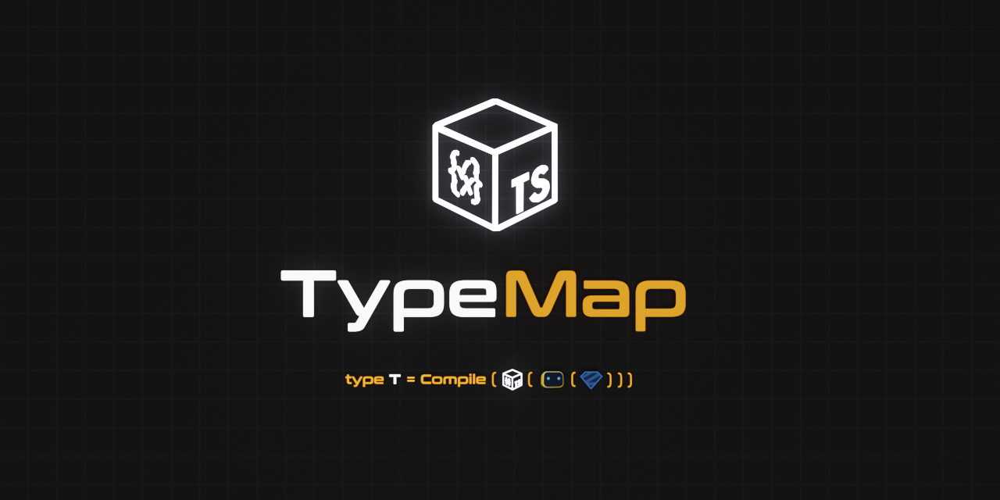

<div align='center'>

<h1>TypeMap</h1>

<p>Syntax Compiler and Translation System for Runtime Types</p>



<br />
<br />

[](https://badge.fury.io/js/%40sinclair%2Ftypemap)

[](https://github.com/sinclairzx81/typemap/actions/workflows/build.yml)
[](https://opensource.org/licenses/MIT)

</div>

## Install

```bash
$ npm install @sinclair/typemap --save
```

## Usage

Parse and Compile Types from TypeScript Syntax ([Example](https://www.typescriptlang.org/play/?moduleResolution=99&module=199&ts=5.8.0-beta#code/JYWwDg9gTgLgBAbzgYQuYAbApnAvnAMyjTgHIABAZ2ADsBjDAQ2CgHoYBPMLERsUgFBxhI0WJEC6EGpXgA3RhmAATRjGhwAvCjRhMWABQADJAA8AXHBoBXEACMsUADRwOlm-cd4jASjitWOCkZeUUVNWhLADUw1XUoAB4AFQB5OwArLDoYBIQhcQLCouKS4QCRCzgkgDlbB2d80qbmpvLhNyrazyhGlr7+kXLcAD5hgUlpWTgoLEprDHhtBSU46AA6ZAALLIBrAyQBwcDGSkR8yoBGF0Obgra4So96p3yOgCZbz7F7jqfHAVwfi+wNEQyAA))

```typescript
import { Compile } from '@sinclair/typemap'
                  
const validator = Compile(`{ x: number, y: number }`) // const validator: Validator<TObject<{
                                                      //   x: TNumber,
                                                      //   y: TNumber
                                                      // }>>

const result = validator.Check({                      // as {
  x: 1,                                               //   x: number,
  y: 2                                                //   y: number
})                                                    // }
```

## Overview

TypeMap is a syntax frontend and compiler backend for the [TypeBox](https://github.com/sinclairzx81/typebox), [Valibot](https://github.com/fabian-hiller/valibot) and [Zod](https://github.com/colinhacks/zod) runtime type libraries. It offers a common TypeScript syntax for type construction, a runtime compiler for high-performance validation and type translation from one library to another.

TypeMap is written as an advanced type mapping system for the TypeBox project. It is designed to accelerate remote type libraries on TypeBox infrastructure as well enabling TypeBox to integrate with remote type library infrastructure via reverse type remapping. This project also offers high-performance validation for frameworks that orientate around the [Standard Schema](https://github.com/standard-schema/standard-schema) TypeScript interface.

License: MIT

## Contents

- [Install](#Install)
- [Usage](#Usage)
- [Overview](#Overview)
- [Example](#Example)
- [Mapping](#Section-Mapping)
  - [Syntax](#Mapping-Syntax)
  - [TypeBox](#Mapping-TypeBox)
  - [Valibot](#Mapping-Valibot)
  - [Zod](#Mapping-Zod)
- [Syntax](#Section-Syntax)
  - [Types](#Syntax-Types)
  - [Options](#Syntax-Options)
  - [Parameters](#Syntax-Parameters)
  - [Generics](#Syntax-Generics)
- [Static](#Section-Static)
- [Json Schema](#Json-Schema)
- [Tree Shake](#Tree-Shake)
- [Compile](#Compile)
- [Benchmark](#Benchmark)
- [Contribute](#Contribute)

## Example

Use TypeScript syntax to create types for TypeBox, Valibot and Zod ([Example](https://www.typescriptlang.org/play/?moduleResolution=99&module=199#code/JYWwDg9gTgLgBAbzgFQJ5gKYCEIA8A0cAagIYA2wARhDIQFoQAmcAvnAGZQQhwDkAAgGdgAOwDGZEsCgB6GOgwgSYXgChVMmXADKqETBK4UCwerEQRg+NrgBeOAAMEquHFwAuOCICuIShih8FzhUTx8-AKDXAC8w338oVRYHdU04ACVvfVAMY0xTVXNLeGQ7POw8AAptAEpXeobGpubGtKKrFE9kAHlKACsMMRgAHiQAOgnWAD4zCw6iMtIKahhqupaNzYa2ufgiT16Boe0xAAtFElG4CbHWQhuZwt24OjKGRjWtr++d4pfPd6HQYjcaTFj3CZTIA))

```typescript
import { TypeBox, Valibot, Zod } from '@sinclair/typemap'

// Syntax Types

const S = `{
  x: number,
  y: number,
  z: number
}`

// Runtime Types

const T = TypeBox(S)                                // const T: TObject<{ ... }>

const V = Valibot(S)                                // const V: ObjectSchema<{ ... }, ...>

const Z = Zod(S)                                    // const Z: ZodObject<{ ... }, ...>
```

Translate TypeBox, Valibot and Zod types ([Example](https://www.typescriptlang.org/play/?moduleResolution=99&module=199#code/JYWwDg9gTgLgBAbzgFQJ5gKYCEIA8A0cAagIYA2wARhDIQFoQAmcAvnAGZQQhwDkAAgGdgAOwDGZEsCgB6GOgwgSYXgChVMmXADKqETBK44AWgB8cBszPFyVGifNpMOXOrEQRg+MjgBeFAouABSkFNQwQZZBAAYIqnBwuABccCIAriCUGFD48XCoKemZ2bkJAF6FGVlQqizRAJSNQA))

```typescript
import { TypeBox, Valibot, Zod } from '@sinclair/typemap'

// Syntax -> Zod -> Valibot -> TypeBox

const T = TypeBox(Valibot(Zod(`{
  x: number,
  y: number,
  z: number
}`)))
```

Compile Valibot and Zod types on TypeBox infrastructure ([Example](https://www.typescriptlang.org/play/?moduleResolution=99&module=199#code/JYWwDg9gTgLgBAbzgYQuYAbApnAvnAMyjTgHIABAZ2ADsBjDAQ2CgHoYBPMLERsUgFADQkWHABehYiDLiIAE0EDWrOAC0FcACpcsQuhBqV4auAF4JAOggAjAFZY6MABRI47j56-efHlXAMjEwAudQUAeXtHGAAeNwF3AA9Q8UsaAFcQGywoZwBKABpfYpLi-yTQjXkAOUzsqCLPBLgOFLS6nPzG0p7S8pbKhVqsnILm8TaMkdzC3rmy1XcJsJqOqAFcPPntnfd-XAA+IX8AJR4+OEYaeRQ0MEw9AUDjFHNb9GxnNS3d3v9n+DIUIANUYGGA8kYMGgMS0kQcTji7mav1RfUWcGS2mG9W6yLRBIWHla2LWY0JFK8-WWWhxORRlIp+wOR2UqgAEsAAOYAC20POI6V5EHS8FB4MhMGAhn0hheJzeyEsyB5jgA1q5GT5-ABJGA5KHSoyhACMAAYAPpm61W63NLEmvFauYqZokgBMTudPX8VV8oQALNazSBKHBnHwwMREnlxqEAMzenb+HTcACyFw8gZDYfcEbAUYgMY2eSAA))

```typescript
import { Compile } from '@sinclair/typemap'

import z from 'zod'

// Zod Type

const Z = z.object({                                // const Z: ZodObject<{  
  x: z.number(),                                    //   x: ZodNumber,     
  y: z.number(),                                    //   y: ZodNumber,
  z: z.number(),                                    //   z: ZodNumber
})                                                  // }>

// Remap and Compile

const C = Compile(Z)                                // const C: Validator<TObject<{  
                                                    //   x: TNumber,     
                                                    //   y: TNumber,
                                                    //   z: TNumber
                                                    // }>>

// High Throughout Validation

const R = C.Check({                                 // Iterations: 10_000_000
  x: 1,                                             //
  y: 2,                                             // Zod        : 4000ms (approx)
  z: 3                                              // TypeMap    : 40ms   (approx)
})
```

<a name="Section-Mapping"></a>

## Mapping

TypeMap is designed for runtime type translation. It provides one mapping function per library which can be used to translate remote types into types specific to that library. All mapping functions make a best effort attempt to translate the structures and semantics from each library. If no translation is possible, these functions return a `never` representation.

<a name="Mapping-Syntax"></a>

### Syntax

Use the `Syntax` function to translate types into a Syntax string ([Example](https://www.typescriptlang.org/play/?moduleResolution=99&module=199#code/JYWwDg9gTgLgBAbzgZQJ4DsYEMAecC+cAZlBCHAOQACAzsOgMYA2WwUA9DKmAKYhZgKAKCGhIsOACo4WGnHgkylWvWasOXXgCMIOYWOjxpsuADdipchVNYmwHTH3hDUmXIBeFpRXcQAJsJCDBDoNPDIcAC8KBjYOAAUFGFQ9ADmANoAuhQAlHD5BYVFxQXs7HDBoeEAXJTJaVkUxfFomLg5QSFhcAAqUTFtCTAAdAByAK4gWjxQ8Tl5JYuLZRVd8D21FOiT01BNJfE93DwAQrodld0Aav2tcfGmw-XoqXMLSx+l5ZfwV5vPqX2zSutnsEBgFzWcAAWrdYrh4u5hjoIEweFh0G9PtiVj8YZsUWiMUDCvFof4ckA))

```typescript
import { Syntax } from '@sinclair/typemap'

const S = Syntax('string[]')                        // const S: 'string[]'      (Syntax)
const T = Syntax(t.Number())                        // const T: 'number'        (TypeBox)
const V = Syntax(v.string())                        // const V: 'string'        (Valibot)
const Z = Syntax(z.boolean())                       // const Z: 'boolean'       (Zod)
```

<a name="Mapping-TypeBox"></a>

### TypeBox

Use the `TypeBox` function to translate types and syntax into TypeBox types ([Example](https://www.typescriptlang.org/play/?moduleResolution=99&module=199#code/JYWwDg9gTgLgBAbzgFQJ5gKYCEIA84C+cAZlBCHAOQACAzsAHYDGANgIbBQD0M6GIbMJQBQw0JFhwAVHDa048UuSp1GrDt16YARnhHjo8GXLgA3EmQqVTbFsF0x94Q9NnyAXheWV3EACYiwkwQDLTwAMpwALwofDi4ABSUYVCMAOYA2gC6lACUcAWFRcUlBVxccMGhEQBcKACCUFBsqAA8yOEwqQxpAHxwCeGoDDBsuLlBIWEo0bGY8QkwAHQAcgCuINoYUAm5+aUHpeWVU-DIdcjrm9uHCWjzeBNV0wBqs-fYeAmmSynpu-tDkCyhVnvAXhdOt00rcXrZ7BAYE9TnAAFrvOJfdxLXQQFgYNgMAHA4HHMFoi44PEEhgHBKo-y5IA))

```typescript
import { TypeBox } from '@sinclair/typemap'

const S = TypeBox('string[]')                       // const S: TArray<TString> (Syntax)
const T = TypeBox(t.Number())                       // const T: TNumber         (TypeBox)
const V = TypeBox(v.string())                       // const V: TString         (Valibot)
const Z = TypeBox(z.boolean())                      // const Z: TBoolean        (Zod)
```

<a name="Mapping-Valibot"></a>

### Valibot

Use the `Valibot` function to translate types and syntax into Valibot types ([Example](https://www.typescriptlang.org/play/?moduleResolution=99&module=199#code/JYWwDg9gTgLgBAbzgNQIYBtgCMLwL5wBmUEIcA5AAIDOwAdgMbqrBQD0MAnmAKYiphyAKCGhIsOACo4qanHjFSFGvSYt2XXjgAewsdHjTZcAG5ESZciYzZce8Aaky5AL3NLyLiABNhQhhB01PAAynAAvCg2ODAAFOTBUPQA5gDaALrkAJRwuXn5BYW5bGxwAUGhAFymAHQAglBQqJwhDAAWfKgAPDW9AHxwsSGcdDCo2ln+gcFwACoRUZgxsTA1AHIAriBYPFCxWTlFR0UlZdPws9Um61s7UK0d-AWxs9w8AEIQE1MVKAtoS1wsWuiRS+0Ox0hxVK5RmyCuNRCMCSdGSD06zwBthgk1h8AAWv9okCXDUcBB0DxUHRwVCoac8XB8QjPhSqXR0U88rF8T4skA))

```typescript
import { Valibot } from '@sinclair/typemap'

const S = Valibot('string[]')                       // const S: v.ArraySchema<...> (Syntax)
const T = Valibot(t.Number())                       // const T: v.NumberSchema     (TypeBox)
const V = Valibot(v.string())                       // const V: v.StringSchema     (Valibot)
const Z = Valibot(z.boolean())                      // const Z: v.BooleanSchema    (Zod)
```

<a name="Mapping-Zod"></a>

### Zod

Use the `Zod` function to translate types and syntax into Zod types ([Example](https://www.typescriptlang.org/play/?moduleResolution=99&module=199#code/JYWwDg9gTgLgBAbzgLQgEzgXzgMyhEOAcgAEBnYAOwGMAbAQ2CgHoYBPMAUxHrCICh+oSLDgAqOPTJx4eAsXJU6jFuy4AjCAA8Bw6PAlS4AN1z5CRY-VrBNMXeH3jJ0gF5n5RV+gH9qESjJ4AGU4AF4UdAAKIiCoKgBzAG0AXSIASjgs7JzcvLzmZjh-QJCALjhXADpUNABBKCh6NgAeKvaAPjgo4LZKGHotdL8AoLgAFXDItCiYKoA5AFcQdU4oKPTM-O2drMLi0fhxiurapZW13Kjxjk4AIW1hkrGANSnaqOMquMSNrd2ATl9s94C8TjV0MEYPFKAkri9rLYIDAnocUO9otVNBBaJx6JQ-oCiXBgWjkODag8cXjKDkorV0kA))

```typescript
import { Zod } from '@sinclair/typemap'

const S = Zod('string[]')                           // const S: z.ZodArray<...> (Syntax)
const T = Zod(t.Number())                           // const T: z.ZodNumber     (TypeBox)
const V = Zod(v.string())                           // const V: z.ZodString     (Valibot)
const Z = Zod(z.boolean())                          // const Z: z.ZodBoolean    (Zod)
```

<a name="Section-Syntax"></a>

## Syntax

TypeMap provides an optional TypeScript syntax parser that can be used to construct library types. Syntax parsing is implemented at runtime as well as in the type system. This feature can be used to uniformly construct types across libraries, as well as create types with embedded remote types.

<a name="Syntax-Types"></a>

### Types

Syntax types can be created by passing a string parameter to any library mapping function. TypeMap supports most TypeScript syntax. If the string contains a syntax error, the function will return a `never` type. ([Example](https://www.typescriptlang.org/play/?moduleResolution=99&module=199#code/JYWwDg9gTgLgBAbzgFQJ5gKYCEIA84C+cAZlBCHAOQACAzsAHYDGANgIbBQD0M6GIbMJQBQwphAa14yOAF4UfHLgAUlJLgBccAIwAaOKi0AmQpQCUcS1es3LXLnHGTpW5AHkARgCsMTGAB4kYVsQ0LDwiLh7K00UABlgGAwoNhZ-bQA+XWDI3LzI6MtDeMTk1P8jDJz8mtq7BwIqsQkpOABlOQVMJVUAQn7zOvDop1a21wA5DAA3ZLgAWnbUBhg2fABRKDIoIA))

```typescript
import { TypeBox } from '@sinclair/typemap'

const T = TypeBox('{ x: 1, y: 2 }')                 // const T: TObject<{ 
                                                    //   x: TLiteral<1>,
                                                    //   y: TLiteral<2>
                                                    // }>

const S = TypeBox('!!!')                            // const S: TNever - Syntax Error
```

<a name="Syntax-Options"></a>

### Options

You can pass Json Schema options on the last parameter of a syntax type. TypeMap translates known [keywords](https://json-schema.org/understanding-json-schema/reference/type) into appropriate runtime representations if possible ([Example](https://www.typescriptlang.org/play/?moduleResolution=99&module=199#code/JYWwDg9gTgLgBAbzgFQJ5gKYCEIA8A0cAWhACZwC+cAZlBCHAOQACAzsAHYDGANgIbAoAehjoMIPmEYAoaVwgdW8ZHAC8KMTlwAKRkqicA5o0JI45i5avW4QoXHmLlALhQBlGAY6G1iaeepoCRhXRnEBHkYbaJjY23tzUUxQ-SMTaQoASjic3Ly7C0CoYNDw4Ej-PKrq6wKKWTkFJTg3XxJSXSRcAH5XDgBXEAAjDChKE0Qa8wLHZtb1AC8AOgghgCsMLhhtJEq+UlJgGGAFPh4ABTpMWGAMVldqM9YMKasC81xXZYHh0e1MlZgY6nHj-DLZV6Q2J1AGpLb-IA))

```typescript
import { TypeBox, Zod } from '@sinclair/typemap'

const T = TypeBox('string', {                       // const T: TString = {
  format: 'email'                                   //   type: 'string',
})                                                  //   format: 'email'
                                                    // }


const S = Zod('{ x?: number }', {                   // const S = z.object({ 
  additionalProperties: false                       //   x: z.number().optional()
})                                                  // }).strict()
```

<a name="Syntax-Parameters"></a>

### Parameters

Syntax types can be parameterized to receive exterior types. Parameters are automatically translated to the receiving type ([Example](https://www.typescriptlang.org/play/?moduleResolution=99&module=199#code/JYWwDg9gTgLgBAbzgNQIYBtgCMIwDRwBaEAJnAL5wBmUEIcA5AAIDOwAdgMbqrBQD0MAJ5gApiFRgGAKGmcI7FvGRwAvCgzZcACgbsAriCyioDAJRxLV6zdvX+-OPMXKAXHAByh41ADKnAAtxVFkHOAAFVChUEFEYExQ4CTAxMipoOBgogHM4ollnJSI1IlJtJBVyAgADJAA3DH1RFndkAG0AXQpqizsbMML4QndiEgB5LAArUU4YAB4kaT7lldW1yzDLBvQmltKSAEEoaKE50a8jEwA+JfW7++WwqsQ4ADp3iiugA))

```typescript
import { Valibot, Zod } from '@sinclair/typemap'

const V = Valibot('number')                         // const V: NumberSchema

// Parameter V mapped for target Z

const Z = Zod({ V }, `{ values: V[] }`)             // const Z: ZodObject<{ 
                                                    //   values: ZodArray<ZodNumber>
                                                    // }, { ... }>
```

<a name="Syntax-Generics"></a>

### Generics

Use parameterized types with functions to create generic syntax types ([Example](https://www.typescriptlang.org/play/?moduleResolution=99&module=199#code/JYWwDg9gTgLgBAbzgFQJ5gKYCEIA8A0cAagIYA2wARhDIQFoQAmcAvnAGZQQhwDkAAgGdgAOwDGZEsCgB6GOgwgSYXgChVMmXADiGERijAxKBerEQRg+EQxiY0OAF44AHmRwMuGHsaC4ESgArWxgAPgAKZAAuFABKJ1CTTBxccKR3FkIAAyRVODhcGORCPLhUIpL8gC8iuFUWLNj1TTgASUsYEnEMZjRMQTMLKxQnYhDocNIKahhw3hEAVxBKA15Y+PzNre38lvMOlCKAeSCQlwRSnavrm9vblvzClAA5JZWoSruv75+4B7Kiq9lgZ8JdfuCIX8tNVAW8QWDIYi7i0WKFBgcAMqjGx2CYMRhzKyGEQAczWG0ReyG8Axx1OdnOCKRzJ2-yeyAxMGJJM+LL523+5RQnO5oP54s2-xqwq5oh5TIlSJRoSAA))

```typescript
import { TypeBox, Valibot, Zod } from '@sinclair/typemap'

// Generic Type

const Vector = <T extends object>(T: T) => TypeBox({ T }, `{ 
  x: T, 
  y: T, 
  z: T 
}`)

// Instanced Types

const T = Vector(Valibot('number'))                 // const T: TObject<{
                                                    //   x: TNumber, 
                                                    //   y: TNumber,
                                                    //   z: TNumber,
                                                    // }>

const S = Vector(Zod('string'))                     // const S: TObject<{
                                                    //   x: TString, 
                                                    //   y: TString,
                                                    //   z: TString,
                                                    // }>
```

## Static

Use Static to infer for library and syntax types 

```typescript
import { type Static } from '@sinclair/typemap'

const T = t.Number()                                // TypeBox
const V = v.string()                                // Valibot
const Z = z.boolean()                               // Zod
const S = 'string[]'                                // Syntax

type S = Static<typeof S>                           // string[]
type T = Static<typeof T>                           // number
type V = Static<typeof V>                           // string
type Z = Static<typeof Z>                           // boolean 
```

<a name="Json-Schema"></a>

## Json Schema

Use `TypeBox` to transform remote library types into Json Schema ([Example](https://www.typescriptlang.org/play/?moduleResolution=99&module=199#code/JYWwDg9gTgLgBAbzgFQJ5gKYCEIA84CGAznAFJEQB2AygMYAWGIBcAvnAGZQQhwDkAASLBKtADYFgUAPQx0TAmD4AoZaEiw4AKkIkAXp268+eiABMVy2lSLwAWnAC8cPQDoIAIwBWGWjAAUSHDBIaFh4REh0tJw1pS2cHYAXC6uduYA8t6+MAA8CMrBuClulACuIB4YUP4AlAA0kU3NTdEhxanpZgByFVVQANyFcKglruWV1XWNLbOzbcGjnea9k4PDemMT-XVze80LLmNdq-1DrLWutlDAfrv7D60xrI0ARNe3MK+Nrr8AfKo2mhMDh8BhROYMCQ5JgSMQyBRKHA6IxmKo4glkE4EVQUQp-HZao95jEMfAsc4CsTqftDjCMCk+J4fH4+PVhjTOU8QlAMABHMpSDBmFIAbT4uDZ-FQUpMfAAuuyucqIocCGYzMAYMAqAQxAAFbiYWDAKEpDh6ogYJUq23BQ5gI3VbVmxAcu3Kw5FFJIemM7bVPhsG0ez0xUJLX3yf19QPB92hmleo6IOB+-gBqBB1gJxPEw45vNctqsIA))

```typescript
import { TypeBox as JsonSchema } from '@sinclair/typemap'

const Z = z.object({                                // const Z: z.ZodObject<{
  x: z.number(),                                    //   x: z.ZodNumber;
  y: z.number(),                                    //   y: z.ZodNumber;
  z: z.number()                                     //   z: z.ZodNumber;
}).strict()                                         // }, "strict", ...>

// TypeBox encodes types as Json Schema

const T = JsonSchema(Z)                             // const T = {
                                                    //   type: 'object',
                                                    //   required: ['x', 'y', 'z'],
                                                    //   additionalProperties: false,
                                                    //   properties: {
                                                    //     x: { type: 'number' },
                                                    //     y: { type: 'number' },
                                                    //     z: { type: 'number' }
                                                    //   }
                                                    // }
```

<a name="Tree-Shake"></a>

## Tree Shake

TypeMap takes on TypeBox, Valibot and Zod as peer dependencies. If bundling, it is recommended that you import specific translation functions. By doing this it will by-pass library imports and enable unused libraries to be omitted from the bundle.

```typescript
import { TypeBoxFromZod } from '@sinclair/typemap'  // Use TypeBox & Zod, Tree Shake Valibot

import * as z from 'zod'

const T = TypeBoxFromZod(z.object({                 // const T: TObject<{
  x: z.number(),                                    //  x: TNumber;
  y: z.number(),                                    //  y: TNumber;
  z: z.number()                                     //  z: TNumber;
}))                                                 // }>
```

## Compile

Use the `Compile` function to compile TypeBox, Valibot and Zod on TypeBox infrastructure ([Example](https://www.typescriptlang.org/play/?moduleResolution=99&module=199#code/JYWwDg9gTgLgBAbzgYQuYAbApgGjgLQgBM4BfOAMyjTgHIABAZ2ADsBjDAQ2CgHoYAnmCwhOYWgCgJvXijRhMWAsTgAVIVilsILRvABunDMCKcY0OAF456bAApCROwAMEEuB4AeALjgsAriAARlhQOO4eAr4BwaHhHnAAXtGBIVASpM4AlFlaOnpwAEoAjFZwhsam5lAAdMgAFlhsANZ2SD5wxXhRcABMeMlwAMxkWQlwMnAAgmxsWNhQZlhEUpMAyjCcLKZQJGtsjaLSvMdwNedwAO71wAdwjPUQ-hgk9Zz6SiFYLH6cIMt0DZbHYkABqRhMZmgkgk2l08EKvTKFUh1QA2rQAH56YGcXa0AC6NRRVSwbTgHS6cB6-SSvhGpCyQA))

```typescript
import { Compile, Zod } from '@sinclair/typemap'

// Compile Zod Type

const validator = Compile(Zod(`{
   x: number,
   y: number,
   z: number
}`))

const R1 = validator.Check({ x: 1, y: 2, z: 3 })    // Accelerated

// Standard Schema
//
// ... which should have been named 'Standard Validator'

const R2 = validator['~standard'].validate({ x: 1, y: 2, z: 3 })
```

## Benchmark

This project manages a small benchmark that compares validation performance using Zod, Valibot, and TypeBox validators. For more comprehensive community benchmarks, refer to the [runtime-type-benchmarks](https://github.com/moltar/typescript-runtime-type-benchmarks) project.

### Test

Benchmarks are run for the following type.

```typescript
type T = { x: number, y: string, z: boolean }
```

### Results

Results show the approximate elapsed time to complete the given iterations

```typescript
┌─────────┬────────────────┬────────────────────┬────────────┬────────────┐
│ (index) │ library        │ using              │ iterations │ elapsed    │
├─────────┼────────────────┼────────────────────┼────────────┼────────────┤
│ 0       │ 'valibot     ' │ 'valibot         ' │ 10000000   │ '1534 ms ' │
│ 1       │ 'valibot     ' │ 'typebox:value   ' │ 10000000   │ '1377 ms ' │
│ 2       │ 'valibot     ' │ 'typebox:compile ' │ 10000000   │ '46 ms   ' │
└─────────┴────────────────┴────────────────────┴────────────┴────────────┘
┌─────────┬────────────────┬────────────────────┬────────────┬────────────┐
│ (index) │ library        │ using              │ iterations │ elapsed    │
├─────────┼────────────────┼────────────────────┼────────────┼────────────┤
│ 0       │ 'zod         ' │ 'zod             ' │ 10000000   │ '4669 ms ' │
│ 1       │ 'zod         ' │ 'typebox:value   ' │ 10000000   │ '1359 ms ' │
│ 2       │ 'zod         ' │ 'typebox:compile ' │ 10000000   │ '47 ms   ' │
└─────────┴────────────────┴────────────────────┴────────────┴────────────┘
```


## Contribute

This project is open to community contributions. Please ensure you submit an open issue before creating a pull request. TypeBox and associated projects preference open community discussion before accepting new features.

